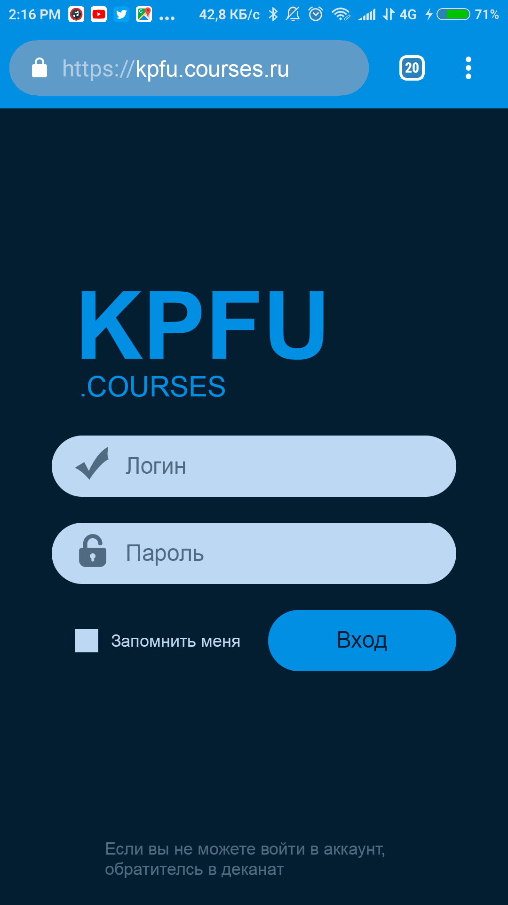
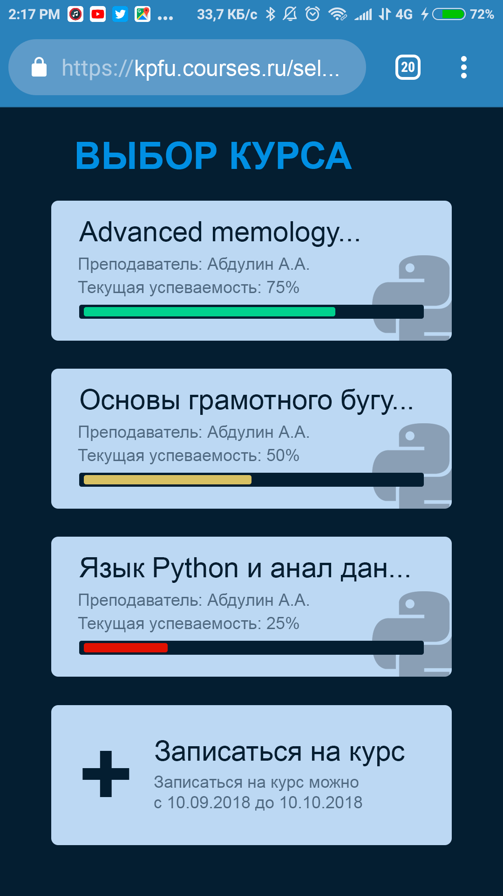
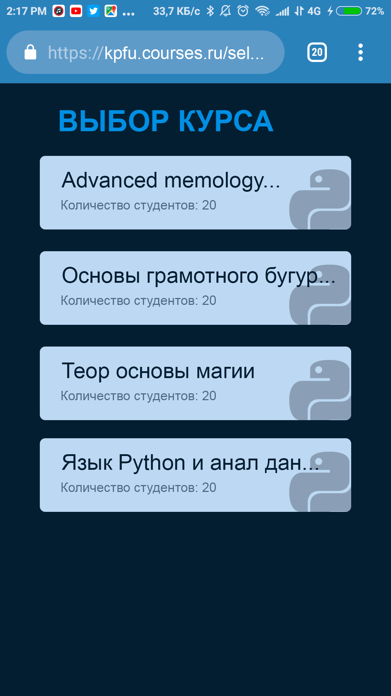
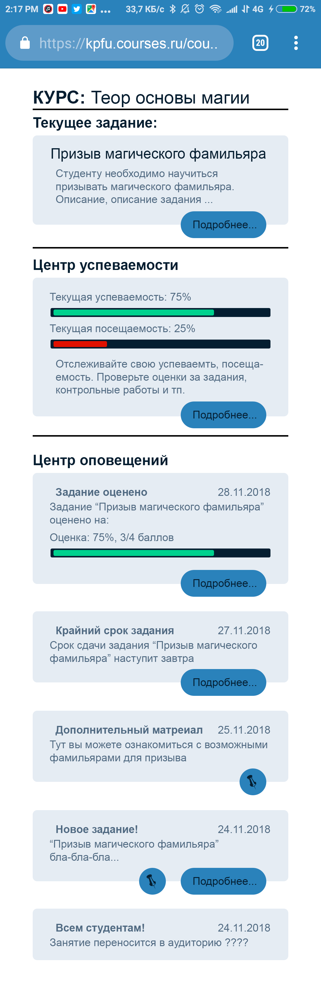
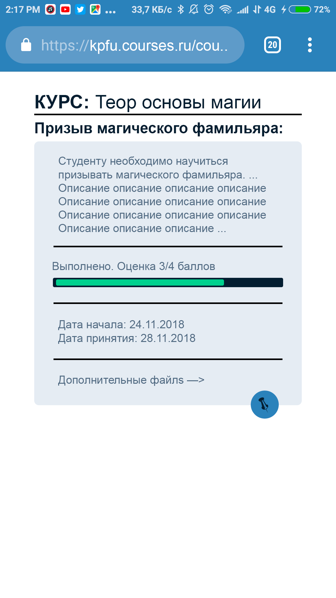
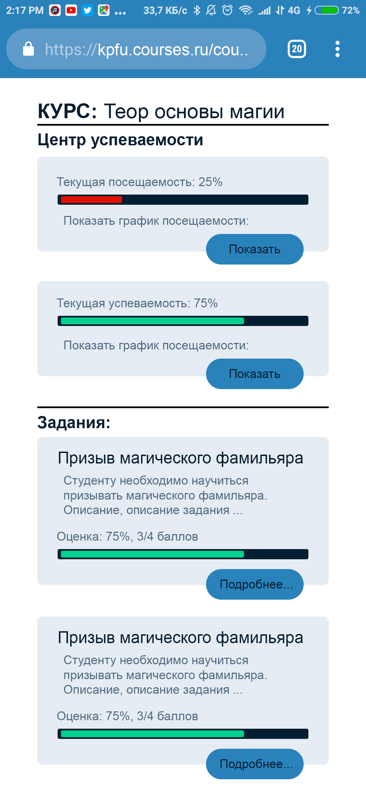

#Базовая демонстрация телеграм бота без сервиса.

* ##Серверная часть:
	* https://bitbucket.org/azatbairamov/courses-service/src/master/

* ##В планах:
    * Реализовать REST-сервис хранения и обработки данных
    * Реализовать Telegram bot для доступа к сервису
    * Реализовать Web-часть для доступа к сервису(На Vue.js)
    * Максимально разделить весь проект на независимые модули (сервис, веб интерфейс, бот телеграм, бот вк)

* ######Реализовано
    * Базовый функционал Telegram bot для демонстрации
    * Базовый "каркас" REST-сервиса (Spring, Hibernate, PostgresSQL)

* ######Участники:
	* Байрамов Азат
	* Лигай Вячеслав
	* Тахаутдинов Камиль
	* Рыжов Егор
	* Низамутдинов Ильгиз

Модель базы данных

Макеты для браузерной версии (приблизительные):

Страница входа:

Выбор курса (для студента и преподавтеля):
          

Страница курса (для студента):

Страница задания с курса (для студента):

Страница центра контроля успеваемости (для студента):
